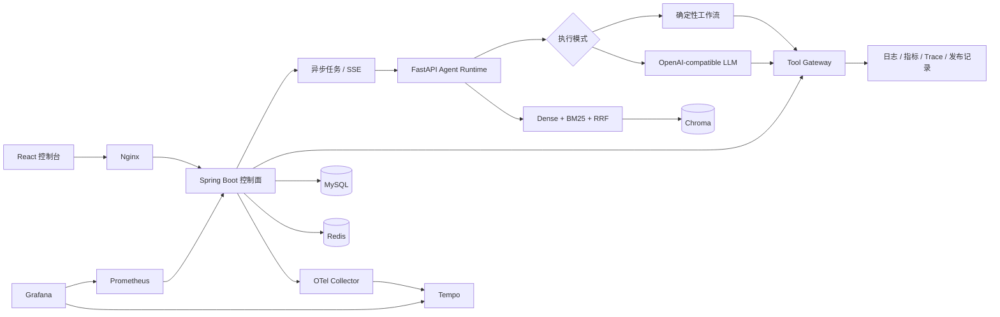

# OpsMind AI

面向微服务故障的证据驱动诊断平台。Spring Boot 负责业务状态、异步任务、
Tool Gateway、审计和稳定性边界；FastAPI 负责诊断编排、混合检索和可选的
LLM Tool Calling。项目关注的不是聊天界面，而是 AI 能力如何安全地进入一条
可追踪、可恢复、可评测的后端工程链路。

```text
故障注入 -> 异步任务 -> SSE 进度 -> 多源取证 -> Runbook RAG
         -> 结构化诊断 -> 报告落库 -> 事故复盘
```

> 2026-08-02 验收：Docker 全栈三场景 `3/3 PASS`，RAG 评测
> `Hit@1 = 1.00 / Hit@3 = 1.00 / MRR = 1.00`。

## 30 秒了解项目

| 问题 | 项目中的答案 |
| --- | --- |
| 解决什么问题 | 聚合日志、指标、Trace、发布记录和 Runbook，生成带证据的故障诊断报告 |
| Java 做什么 | 管理故障、任务、SSE、工具权限、审计、Redis、Resilience4j 和可观测性 |
| Python 做什么 | 执行确定性诊断或模型驱动工具循环，并完成 Dense + BM25 + RRF 检索 |
| 默认是否要密钥 | 不需要；默认 `deterministic`，便于稳定演示和自动回归 |
| 能否接真实模型 | 可以；`llm` 模式支持 OpenAI-compatible `/chat/completions` Tool Calling |
| 如何证明可用 | 单元测试、Compose smoke、三场景诊断评测、24 条 RAG 评测和浏览器验收 |

两种执行模式使用同一份请求与报告合同：

| 模式 | 用途 | 当前验收状态 |
| --- | --- | --- |
| `deterministic` | 无密钥演示、稳定回归、离线作品展示 | 已完成完整 Docker 端到端验收 |
| `llm` | 模型自主选择只读取证工具 | 已完成实现和模拟模型单测；未使用真实供应商密钥验收 |
| `LLM_FALLBACK` | 模型网络或合同失败后显式降级 | 已完成自动测试，审计中可识别降级 |

## 验收结果

| 验收项 | 结果 |
| --- | --- |
| 支付超时、Redis 失败、数据库慢查询 | `3/3 PASS`，置信度分别为 0.86 / 0.84 / 0.85 |
| 混合检索评测 | 9 份 Runbook、24 条查询，Hit@1 / Hit@3 / MRR 均为 1.00 |
| Java 单元测试 | `16/16 PASS` |
| Python 单元测试 | `24/24 PASS` |
| React 生产构建 | PASS |
| Docker Compose | 10 个服务健康启动，HTTP smoke PASS |
| 浏览器布局 | 1440x1000 / 390x844 无横向溢出，控制台 0 error |
| 可观测性 | Prometheus、Grafana、OpenTelemetry、Tempo 已打通 |

评测证据：

- [三场景诊断报告](evaluation/results/report.md)
- [RAG 排名结果](evaluation/results/rag_report.json)

这些数字是固定演示集上的回归结果，不代表生产环境准确率。项目把数据集、门槛、
脚本和原始结果一并保留，方便面试时解释“如何测”，而不只展示一个百分比。

## 核心能力

### 诊断与 Agent

- 三种可重复故障：`payment-timeout`、`redis-connection-failure`、
  `database-slow-query`。
- 异步状态机：`PENDING / RUNNING / SUCCESS / FAILED`。
- SSE 推送 AI 调用、工具开始、工具成功/失败和任务终态。
- Tool Gateway 提供六个精确白名单工具：日志、指标、Trace、Runbook、发布记录和复盘。
- LLM 模式最多执行 6 轮，只有完成五类只读取证后才能提交最终报告。
- 模型输出必须通过 Pydantic 结构校验；可信的 `incidentId` 和 `traceId` 由运行时覆盖。
- 外部模型失败可显式降级到确定性流程，不会把降级伪装成 LLM 成功。

### RAG 与评测

- 9 份中文 Runbook，覆盖 3 个演示场景和 6 个长尾干扰场景。
- `BAAI/bge-small-zh-v1.5` 生成 Dense 向量，Chroma 保存向量和来源元数据。
- 中文字符 unigram/bigram 与英文词元组成 BM25 稀疏检索。
- Reciprocal Rank Fusion 合并 Dense 和 BM25 排名，结果暴露检索模式和排名信息。
- 24 条中英文混合查询计算 Hit@1、Hit@3 和 MRR，并设置失败退出门槛。
- 诊断评测真实执行 HTTP、异步等待、报告查询、复盘和工具审计五维评分。

### 后端工程化

- MySQL 保存 Incident、任务、诊断报告、工具审计和 AI 调用审计。
- Redis 保存任务快照、10 分钟结果复用、固定窗口限流和分布式去重锁。
- Resilience4j 提供有限重试、熔断和 Bulkhead 并发隔离。
- Tool Gateway 校验任务与故障归属，并进一步限制服务名、Trace 来源和查询长度。
- 外部 DTO 隐藏工具原始请求，错误信息在系统边界统一处理。
- AI 审计保存执行模式、供应商、模型、Prompt 版本、Token 和模型工具调用数。

### 可观测与展示

- Micrometer 暴露任务、工具、AI 调用、Agent 模式、Token 和模型工具调用指标。
- 模型名和 Prompt 版本只进入审计，不作为 Prometheus 标签，避免高基数。
- W3C Trace Context 贯穿入口、异步线程、Python 调用和工具回调。
- OpenTelemetry Collector 将 Trace 写入 Tempo，Grafana 自动加载指标和链路数据源。
- React 控制台展示故障注入、SSE 时间线、调用审计、模型元数据、报告和事故复盘。

## 系统架构



一次异步诊断的主调用链：

```text
React
  -> DiagnosisTaskService 保存 PENDING 并立即返回 taskId
  -> DiagnosisTaskExecutor 在异步线程标记 RUNNING
  -> DiagnosisService 组装可信故障上下文
  -> AiDiagnosisClient 调用 FastAPI
  -> AgentOrchestrator 选择 deterministic 或 llm
  -> Python 通过 Spring Tool Gateway 取证
  -> Spring 保存工具审计，Python 返回结构化报告
  -> Spring 保存 DiagnosisRecord 和 AI 审计
  -> SSE 推送 SUCCESS 或 FAILED 并关闭连接
```

更详细的方法与合同见 [调用链与 API 说明](docs/06-architecture-and-api.md) 和
[LLM Agent、RAG 与评测](docs/07-llm-agent-and-evaluation.md)。

## 一键启动

要求：

- Docker Desktop
- 建议预留至少 4 GB 磁盘空间
- 首次启动需要联网下载镜像、Maven 依赖和中文向量模型

```bash
git clone https://github.com/Hidingbrass/opsmind-ai.git
cd opsmind-ai
docker compose up --build -d
docker compose ps
```

默认使用 Maven Central。国内网络较慢时可显式切换容器构建镜像，配置不会影响
本机 Maven 或运行时：

```bash
MAVEN_MIRROR_URL=https://maven.aliyun.com/repository/public \
  docker compose up --build -d
```

首次启动 AI 容器会下载 embedding 模型，并把 9 份 Runbook 导入为 45 个片段。
后续启动复用 Docker Volume 中的模型与 Chroma 数据。

### 服务入口

| 服务 | 地址 | 用途 |
| --- | --- | --- |
| OpsMind 控制台 | `http://127.0.0.1:3000` | 项目演示主入口 |
| Spring Boot | `http://127.0.0.1:8080` | 业务 API |
| Swagger UI | `http://127.0.0.1:8080/swagger-ui/index.html` | 接口文档 |
| FastAPI Docs | `http://127.0.0.1:8000/docs` | AI/RAG 接口 |
| Chroma | `http://127.0.0.1:8001` | 向量数据库 |
| Prometheus | `http://127.0.0.1:9090` | 指标查询 |
| Grafana | `http://127.0.0.1:3001` | `admin / opsmind` |
| Tempo | `http://127.0.0.1:3200` | Trace 查询 API |

健康检查：

```bash
curl http://127.0.0.1:8080/actuator/health
curl http://127.0.0.1:8000/ai/health
curl http://127.0.0.1:3200/ready
```

停止服务使用 `docker compose down`。只有确认要删除数据库、缓存、向量库和模型
Volume 时才使用 `docker compose down -v`。

## 可选 LLM 模式

供应商需要兼容 OpenAI Chat Completions 的 `tools` / `tool_calls` 合同。Base URL
应包含供应商的 API 版本前缀，但不要包含 `/chat/completions`：

```bash
export OPSMIND_DIAGNOSIS_MODE=llm
export OPSMIND_LLM_PROVIDER=openai-compatible
export OPSMIND_LLM_BASE_URL=https://provider.example/v1
export OPSMIND_LLM_API_KEY=replace-with-your-secret
export OPSMIND_LLM_MODEL=replace-with-tool-capable-model
export OPSMIND_LLM_FALLBACK_ENABLED=true
docker compose up -d --force-recreate ai-agent backend frontend
```

密钥只通过环境变量进入 AI 进程，不进入 Git、报告或日志。切换后先检查：

```bash
curl http://127.0.0.1:8000/ai/health
```

健康响应中的 `diagnosisMode` 应为 `llm`，`llmConfigured` 应为 `true`。没有真实
供应商验收证据前，简历中不要写“已上线某模型”或引用 Token/延迟数字。

## 3 分钟演示

1. 打开 `http://127.0.0.1:3000`。
2. 注入支付超时、Redis 失败或数据库慢查询。
3. 点击“开始 AI 诊断”，观察接口立即返回任务并建立 SSE。
4. 查看日志、指标、Trace、发布记录和 Runbook 的取证审计。
5. 查看执行模式、模型/Prompt、根因、证据、置信度和建议。
6. 点击“生成事故复盘”，确认新增工具审计。
7. 刷新页面，验证任务、报告和审计可从后端恢复。
8. 使用报告中的 `traceId` 到 Tempo 或 Grafana 查询完整链路。

## 自动验证

本地验证需要 Java 21、Maven、Python 3.11、Node.js 22 和 Docker。创建 Python
虚拟环境并安装依赖后，可运行统一入口：

```bash
cd ai-agent-service
python3.11 -m venv .venv
./.venv/bin/pip install -r requirements.txt
cd ..
./scripts/verify.sh
```

`verify.sh` 会依次校验 Compose、运行 Java/Python 测试并构建 React。完整服务启动后：

```bash
./scripts/smoke_http.py --output evaluation/results

ai-agent-service/.venv/bin/python evaluation/run_rag_evaluation.py \
  --output evaluation/results/rag_report.json
```

RAG 默认门槛为 `Hit@1 >= 0.80`、`Hit@3 >= 1.00`、`MRR >= 0.85`；低于门槛
脚本返回非零退出码。

## 实现边界

已实现并完成整栈验收：

- 确定性多工具诊断、混合 RAG、任务/SSE、工具网关、审计、稳定性和可观测性。
- 固定三场景 HTTP 评测、24 条 RAG 回归集、桌面和移动端浏览器验收。

已实现但仍需外部条件验收：

- OpenAI-compatible 模型驱动 Tool Calling。当前使用模拟模型响应覆盖正常循环、
  未知工具、跨 Trace、Prompt Injection 和显式 fallback；未配置真实 API Key。

明确不宣称：

- 模拟日志、指标、Trace 和发布记录不是真实生产数据源。
- 当前没有多租户、企业级鉴权、人工审批、真实告警接入或生产 SLO。
- 24 条 RAG 数据集是回归集，不是行业基准；没有用它证明生产准确率。
- 当前是单 Agent 运行时，不把开发阶段的主/子 Agent 协作包装成产品能力。

## 仓库结构

```text
backend-springboot/   Spring Boot 控制面、Tool Gateway、审计和稳定性
ai-agent-service/    FastAPI Agent Runtime、混合 RAG 和 Runbook
frontend-dashboard/  React + Vite 运维控制台
evaluation/          诊断/RAG 数据集、脚本和可复核结果
observability/       Prometheus、Grafana、OTel Collector、Tempo
scripts/             本地统一验证和整栈 smoke
docs/                架构、路线、复盘、协作和面试材料
docker-compose.yml   完整本地多服务编排
```

## 延伸阅读

- [项目蓝图](docs/00-project-blueprint.md)
- [完成状态与后续路线](docs/01-roadmap.md)
- [学习地图](docs/02-learning-map.md)
- [简历与面试材料](docs/03-resume-and-interview.md)
- [协作与教学规则](docs/04-collaboration-rules.md)
- [完整执行规划](docs/05-execution-plan.md)
- [调用链、Service 分工和 API](docs/06-architecture-and-api.md)
- [LLM Agent、RAG 与评测](docs/07-llm-agent-and-evaluation.md)
- [项目复盘与 Codex 协作方法](docs/08-retrospective-and-codex.md)
