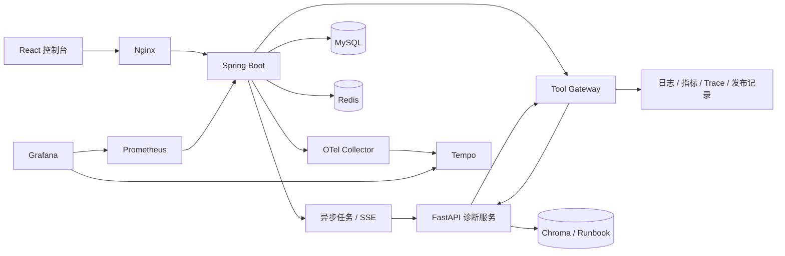

# OpsMind AI

面向微服务故障的证据驱动诊断平台。项目以 Spring Boot 作为业务控制面，
以 FastAPI 执行多工具取证和 Runbook RAG，把一次耗时、易失败的 AI 诊断
做成可追踪、可审计、可恢复、可自动评测的完整后端流程。

```text
故障注入 -> 异步任务 -> SSE 进度 -> 多工具取证 -> Runbook RAG
         -> 结构化诊断 -> 报告落库 -> 事故复盘
```

> 当前版本已完成 Docker 全栈验收，三种故障场景自动评测 `3/3 PASS`。

## 30 秒了解项目

| 你想知道什么 | 项目中的答案 |
| --- | --- |
| 解决什么问题 | 聚合日志、指标、Trace、发布记录和 Runbook，生成带证据的故障诊断报告 |
| Java 做什么 | 管理故障、异步任务、Tool Gateway、审计、Redis、SSE、稳定性和可观测性 |
| Python 做什么 | 编排取证工具、执行中文向量检索、归纳证据并生成结构化诊断 |
| 如何保护系统 | Redis 限流与去重，HTTP 超时，Resilience4j 重试、熔断和并发隔离 |
| 如何证明可用 | Java/Python 自动测试、三场景 HTTP 评测、Prometheus 指标和 Tempo Trace |
| 是否依赖 API Key | 不依赖；默认使用确定性多工具工作流和本地中文 embedding 模型 |

这个项目的重点不是聊天页面，而是 **AI 能力如何进入真实后端工程链路**：

- HTTP 请求立即返回 `taskId`，耗时诊断在后台执行。
- Python 不能直接访问业务数据库，所有工具必须经过 Spring Tool Gateway。
- 数据库先保存可靠状态，Redis 做加速，SSE 只负责实时通知。
- 每次工具调用、AI 服务调用和最终报告都能按 `traceId` 追溯。
- 诊断结果不是“看起来合理”，而是通过固定数据集自动评分。

## 验收结果

| 验收项 | 结果 |
| --- | --- |
| 支付超时诊断 | PASS，置信度 0.86 |
| Redis 连接失败诊断 | PASS，置信度 0.84 |
| 数据库慢查询诊断 | PASS，置信度 0.85 |
| Java 单元测试 | 13/13 PASS |
| Python 单元测试 | 8/8 PASS |
| React 生产构建 | PASS |
| Docker Compose | 10 个服务完整启动 |
| 浏览器布局 | 1280px / 390px 无横向溢出 |
| 可观测性 | Prometheus、Grafana、OpenTelemetry、Tempo 已打通 |

详细结果见 [三场景评测报告](evaluation/results/report.md)。

## 核心能力

### 诊断闭环

- 三种可重复故障：`payment-timeout`、`redis-connection-failure`、
  `database-slow-query`。
- 异步状态机：`PENDING / RUNNING / SUCCESS / FAILED`。
- SSE 阶段事件：AI 调用、工具开始、工具成功/失败和任务终态。
- 六个白名单工具：
  `queryLogs`、`queryMetrics`、`queryTrace`、`searchRunbook`、
  `getRecentDeployments`、`generateIncidentReport`。
- 使用 `BAAI/bge-small-zh-v1.5` 和 Chroma 检索中文 Runbook。
- 报告包含摘要、根因、证据、知识库来源、建议和置信度。

### 后端工程化

- MySQL 保存故障、任务、诊断报告、工具审计和 AI 调用审计。
- Redis 保存任务快照、10 分钟结果复用、固定窗口限流和分布式去重锁。
- Resilience4j 提供有限重试、熔断和 Bulkhead 并发隔离。
- Tool Gateway 校验 `taskId` 与 `incidentId` 归属，只执行精确白名单。
- 对外审计 DTO 隐藏工具原始请求，失败信息经过统一边界处理。
- Swagger UI 展示完整 Spring Boot API。

### 可观测与展示

- Micrometer 暴露任务、工具和 AI 调用的数量、状态与耗时。
- W3C Trace Context 贯穿入口请求、异步线程、Python 调用和工具回调。
- OpenTelemetry Collector 将 Trace 写入 Tempo。
- Grafana 自动加载 Prometheus、Tempo 数据源和 OpsMind Dashboard。
- React 控制台支持故障注入、SSE 时间线、审计、报告、TraceId 和事故复盘。

## 系统架构



一次异步诊断的真实调用顺序：

```text
React
  -> DiagnosisTaskController
  -> DiagnosisTaskService 创建 PENDING 任务并返回 taskId
  -> DiagnosisTaskExecutor 在异步线程标记 RUNNING
  -> DiagnosisService 组装故障上下文
  -> AiDiagnosisClient 调用 FastAPI
  -> Python 依次回调 Spring Tool Gateway
  -> Tool Gateway 执行工具并保存审计
  -> Python 返回结构化报告
  -> Spring 保存 DiagnosisRecord 和 SUCCESS
  -> SSE 推送终态并关闭连接
```

更详细的方法分工见
[调用链与 API 说明](docs/06-architecture-and-api.md)。

## 一键启动

要求：

- Docker Desktop
- 建议预留至少 4 GB 磁盘空间
- 首次启动需要联网下载镜像、Maven 依赖和中文向量模型

```bash
git clone https://github.com/Hidingbrass/opsmind-ai.git
cd opsmind-ai
docker compose up --build -d
docker compose ps
```

首次启动 AI 容器会下载 embedding 模型并导入 18 个 Runbook 文档片段。
后续启动会复用 Docker Volume 中的数据。

### 服务入口

| 服务 | 地址 | 用途 |
| --- | --- | --- |
| OpsMind 控制台 | `http://127.0.0.1:3000` | 项目演示主入口 |
| Spring Boot | `http://127.0.0.1:8080` | 业务 API |
| Swagger UI | `http://127.0.0.1:8080/swagger-ui/index.html` | 接口文档 |
| FastAPI Docs | `http://127.0.0.1:8000/docs` | AI/RAG 接口 |
| Chroma | `http://127.0.0.1:8001` | 向量数据库 |
| Prometheus | `http://127.0.0.1:9090` | 指标查询 |
| Grafana | `http://127.0.0.1:3001` | `admin / opsmind` |
| Tempo | `http://127.0.0.1:3200` | Trace 查询 API |

健康检查：

```bash
curl http://127.0.0.1:8080/actuator/health
curl http://127.0.0.1:8000/ai/health
curl http://127.0.0.1:3200/ready
```

停止服务：

```bash
docker compose down
```

只有需要删除 MySQL、Redis、Chroma 和模型缓存时才使用：

```bash
docker compose down -v
```

## 3 分钟演示

1. 打开 `http://127.0.0.1:3000`。
2. 注入支付超时、Redis 失败或数据库慢查询。
3. 点击“开始 AI 诊断”，观察接口立即返回任务并建立 SSE。
4. 查看日志、指标、Trace、发布记录和 Runbook 工具阶段。
5. 查看根因、证据来源、置信度和处置建议。
6. 点击“生成事故复盘”，确认新增工具审计。
7. 刷新页面，验证任务、报告和审计可以从后端恢复。
8. 使用报告中的 `traceId` 到 Tempo 或 Grafana 查询完整链路。

## 自动验证

本地执行测试需要 Java 21、Maven、Python 3.11 和 Node.js 22。第一次运行先创建
Python 虚拟环境：

```bash
cd ai-agent-service
python3.11 -m venv .venv
./.venv/bin/pip install -r requirements.txt
cd ..
```

然后分别运行：

```bash
# Java
cd backend-springboot
mvn test

# Python
cd ../ai-agent-service
./.venv/bin/python -m unittest discover -s tests -v

# React
cd ../frontend-dashboard
npm install
npm run build

# 三场景真实 HTTP 评测，需要完整服务已经启动
cd ..
ai-agent-service/.venv/bin/python evaluation/run_evaluation.py
```

评测会真实执行：

```text
注入故障 -> 创建异步任务 -> 等待终态 -> 查询报告
         -> 生成事故复盘 -> 查询工具审计 -> 五维评分
```

评分维度包括根因、证据、建议、六工具覆盖和复盘一致性。

## 关键 API

```text
POST /api/fault-scenarios/{scenarioKey}/inject
POST /api/diagnosis-tasks/incidents/{incidentId}
GET  /api/diagnosis-tasks/{taskId}
GET  /api/diagnosis-tasks?incidentId={incidentId}
GET  /api/diagnosis-tasks/{taskId}/events
POST /api/tools/execute
GET  /api/tool-call-audits?taskId={taskId}
GET  /api/ai-call-audits?taskId={taskId}
GET  /api/diagnoses/incidents/{incidentId}/records
GET  /ai/runbooks/search
POST /ai/diagnose
```

## 实现边界

当前 Python 服务采用 **确定性多工具诊断工作流**，不是外部生成式模型自主
Function Calling。这样设计是为了：

- 不需要 API Key，项目可以离线重复演示。
- 三种固定故障具有稳定、可自动回归的输出。
- evidence 只引用真实命中的观测数据和 Runbook，不编造证据。
- 将来接入外部 LLM 时，可以继续复用 Java Tool Gateway、审计、任务和稳定性边界。

因此，简历和面试中应该描述为：

```text
中文 embedding Runbook RAG + 确定性多工具工作流
```

而不是尚未实现的：

```text
外部大模型自主 Function Calling
```

## 仓库结构

```text
backend-springboot/   Spring Boot 控制面、Tool Gateway、审计和稳定性
ai-agent-service/    FastAPI 多工具诊断与 Runbook RAG
frontend-dashboard/  React + Vite 运维控制台
evaluation/          三场景数据集、评测脚本和结果
observability/       Prometheus、Grafana、OTel Collector、Tempo
docs/                架构、路线、学习规则和面试材料
docker-compose.yml   完整本地多服务编排
```

## 延伸阅读

- [项目蓝图](docs/00-project-blueprint.md)
- [完成状态与验收清单](docs/01-roadmap.md)
- [学习地图](docs/02-learning-map.md)
- [简历与面试材料](docs/03-resume-and-interview.md)
- [协作与教学规则](docs/04-collaboration-rules.md)
- [完整执行规划](docs/05-execution-plan.md)
- [调用链、Service 分工和 API](docs/06-architecture-and-api.md)
