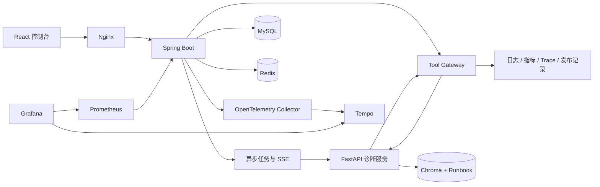

# OpsMind AI

OpsMind AI 是一个面向微服务故障的 AI SRE 诊断平台。它以 Spring Boot
作为业务控制面，以 Python FastAPI 执行多工具诊断与 Runbook RAG，完整覆盖：

```text
故障注入 -> 异步任务 -> SSE 过程 -> 工具取证 -> RAG -> 诊断落库 -> 事故复盘
```

项目重点不是聊天界面，而是 AI 应用落地时真正需要的任务编排、权限边界、
失败恢复、审计、缓存限流、可观测性和质量评测。

## 当前能力

- 三种可重复故障：支付超时、Redis 连接失败、数据库慢查询。
- 异步诊断任务：立即返回 `taskId`，后台推进
  `PENDING / RUNNING / SUCCESS / FAILED`。
- SSE 实时过程：任务、AI 调用和每次工具调用都有阶段事件，终态自动关闭连接。
- 六个白名单工具：`queryLogs`、`queryMetrics`、`queryTrace`、
  `searchRunbook`、`getRecentDeployments`、`generateIncidentReport`。
- Runbook RAG：使用 `BAAI/bge-small-zh-v1.5` 中文向量模型和 Chroma，
  报告证据保留知识库来源。
- MySQL 审计：任务、诊断报告、工具调用和 Python AI 服务调用均可追溯。
- Redis 工程化：任务状态缓存、10 分钟结果复用、分布式去重锁和固定窗口限流。
- Resilience4j：AI 服务调用具有超时、有限重试、熔断、并发隔离和友好降级。
- 可观测性：Prometheus 业务指标、Grafana Dashboard、W3C Trace Context、
  OpenTelemetry Collector 和 Tempo。
- React 控制台：故障注入、SSE 时间线、工具/AI 审计、TraceId、诊断报告和事故复盘。
- 自动评测：真实 HTTP 闭环运行三种故障，当前结果为 `3/3 PASS`。
- Docker Compose：编排前端、后端、AI、MySQL、Redis、Chroma 和监控组件。

## 实现边界

当前 Python 诊断器采用**确定性多工具工作流**：按固定证据顺序调用 Tool Gateway，
再根据日志、指标、链路和 Runbook 生成结构化结果。这样本地不需要外部 API Key，
三场景可以稳定复现和自动评测。

项目使用了中文 embedding 模型完成语义检索，但默认没有接入外部生成式 LLM，
因此文档不把当前实现描述为“模型自主 Function Calling”。后续可以在 Python
服务中接入任意模型供应商，Java Tool Gateway、审计、限流和任务边界无需改动。

## 系统架构



职责边界：

- Spring Boot：业务状态、异步任务、Tool Gateway、审计、Redis、SSE、稳定性和指标。
- FastAPI：工具取证编排、RAG 检索、证据归纳和结构化诊断。
- MySQL：可靠业务状态；Redis：加速、限流和并发协调。
- Chroma：Runbook 向量检索；Prometheus/Tempo：平台自身可观测性。

## 一键启动

要求：Docker Desktop 已启动，建议为首次下载模型预留至少 4 GB 磁盘空间。

```bash
cd /Users/a1-6/Documents/快速简历项目
docker compose up --build -d
docker compose ps
```

首次启动 AI 容器会下载中文向量模型并导入 Runbook，耗时取决于网络。Compose
健康检查会等待 MySQL、Redis、Chroma 和 AI 真正可用后再启动依赖服务。

服务入口：

| 服务 | 地址 | 说明 |
| --- | --- | --- |
| OpsMind 控制台 | `http://127.0.0.1:3000` | 完整演示入口 |
| Spring Boot | `http://127.0.0.1:8080` | 业务 API |
| Swagger UI | `http://127.0.0.1:8080/swagger-ui/index.html` | OpenAPI 文档 |
| FastAPI | `http://127.0.0.1:8000/docs` | AI/RAG API |
| Prometheus | `http://127.0.0.1:9090` | 指标查询 |
| Grafana | `http://127.0.0.1:3001` | `admin / opsmind` |
| Tempo | `http://127.0.0.1:3200` | Trace 查询 API |

健康检查：

```bash
curl http://127.0.0.1:8080/actuator/health
curl http://127.0.0.1:8000/ai/health
curl http://127.0.0.1:8001/api/v1/heartbeat
```

停止服务：

```bash
docker compose down
```

需要同时清空本地演示数据时才使用：

```bash
docker compose down -v
```

## 本地开发

只启动基础设施：

```bash
docker compose up -d mysql redis chroma
```

启动 AI 服务：

```bash
cd /Users/a1-6/Documents/快速简历项目/ai-agent-service
source .venv/bin/activate
python -m scripts.ingest_runbooks
uvicorn app.main:app --reload --port 8000
```

启动后端：

```bash
cd /Users/a1-6/Documents/快速简历项目/backend-springboot
mvn spring-boot:run
```

启动前端：

```bash
cd /Users/a1-6/Documents/快速简历项目/frontend-dashboard
npm install
npm run dev
```

本地前端地址为 `http://127.0.0.1:5173`，Vite 会代理 `/api` 到 Spring Boot。

## 演示流程

1. 打开控制台并选择一种故障注入。
2. 点击“开始 AI 诊断”，前端立即获得 `taskId` 并建立 SSE。
3. 时间线展示 AI 调用及日志、指标、Trace、发布记录、Runbook 工具阶段。
4. 成功后查看根因、证据来源、置信度和处置建议。
5. 点击“生成事故复盘”，Tool Gateway 会执行工具并新增一条审计。
6. 刷新页面，最近任务、报告、工具审计和 TraceId 会从后端恢复。

## 自动验证

Java 单元测试：

```bash
cd backend-springboot
mvn test
```

Python 单元测试：

```bash
cd ai-agent-service
./.venv/bin/python -m unittest discover -s tests -v
```

前端生产构建：

```bash
cd frontend-dashboard
npm run build
```

三场景真实 HTTP 评测：

```bash
cd /Users/a1-6/Documents/快速简历项目
ai-agent-service/.venv/bin/python evaluation/run_evaluation.py
```

评测产物：

- `evaluation/results/report.json`
- `evaluation/results/report.md`

当前评测结果：

| 场景 | 结果 | 置信度 |
| --- | --- | ---: |
| payment-timeout | PASS | 0.86 |
| redis-connection-failure | PASS | 0.84 |
| database-slow-query | PASS | 0.85 |

## 关键接口

```text
POST /api/fault-scenarios/{scenarioKey}/inject
POST /api/diagnosis-tasks/incidents/{incidentId}
GET  /api/diagnosis-tasks/{taskId}
GET  /api/diagnosis-tasks?incidentId={incidentId}
GET  /api/diagnosis-tasks/{taskId}/events
POST /api/tools/execute
GET  /api/tool-call-audits?taskId={taskId}
GET  /api/ai-call-audits?taskId={taskId}
GET  /api/diagnoses/incidents/{incidentId}/records
GET  /ai/runbooks/search
POST /ai/diagnose
```

## 可观测性

业务指标从 `/actuator/prometheus` 暴露：

```text
opsmind_diagnosis_tasks_total
opsmind_diagnosis_task_duration_seconds
opsmind_tool_calls_total
opsmind_tool_call_duration_seconds
opsmind_ai_calls_total
opsmind_ai_call_duration_seconds
```

`traceId` 会贯穿：

```text
HTTP 请求 -> DiagnosisTask -> 异步线程 -> Python 调用
-> Tool Gateway 回调 -> Tool/Ai 审计 -> DiagnosisRecord
```

Resilience4j 只读状态入口：

```text
/actuator/circuitbreakers
/actuator/circuitbreakerevents
/actuator/retries
/actuator/bulkheads
```

## 仓库结构

```text
backend-springboot/   Spring Boot 业务后端和 Tool Gateway
ai-agent-service/    FastAPI 多工具诊断与 Runbook RAG
frontend-dashboard/  React + Vite 控制台
evaluation/          三场景数据集、脚本和报告
observability/       Prometheus、Grafana、OTel Collector、Tempo
docs/                架构、路线、学习和面试材料
docker-compose.yml   完整本地编排
```

更详细的架构和交付状态见：

- [项目蓝图](docs/00-project-blueprint.md)
- [开发路线图](docs/01-roadmap.md)
- [学习地图](docs/02-learning-map.md)
- [简历与面试材料](docs/03-resume-and-interview.md)
- [协作规则](docs/04-collaboration-rules.md)
- [执行规划](docs/05-execution-plan.md)
- [调用链与 API 说明](docs/06-architecture-and-api.md)
