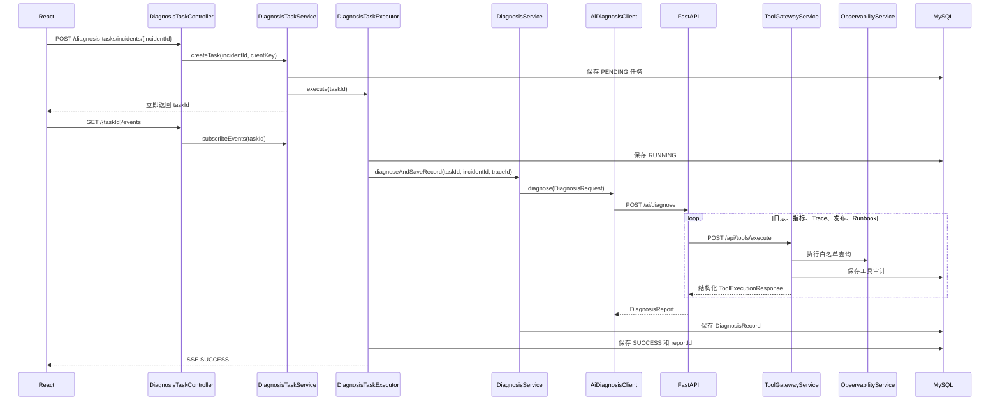

# 调用链与 API 说明

这份文档解释 OpsMind AI 的真实方法调用顺序、各个 Service 的职责和常用 API
调用方式。阅读代码时可以先看这里，再进入具体类。

## 一次完整诊断



重要顺序：

```text
数据库状态先保存 -> Redis 快照更新 -> SSE 再推送
```

数据库是可靠事实，SSE 只是实时通知。即使浏览器断线，页面刷新后仍能从数据库恢复。

## Service 分工

### `DiagnosisTaskService`

职责：

- 校验故障是否存在。
- 查询 Redis 中是否有可复用任务。
- 执行客户端限流和同故障分布式去重。
- 创建 `PENDING` 任务并立即返回。
- 查询任务或建立 SSE 订阅。

它不执行 AI 诊断。真正耗时的工作交给 `DiagnosisTaskExecutor`。

### `DiagnosisTaskExecutor`

职责：

- 在 `@Async` 线程中执行任务。
- 推进 `RUNNING / SUCCESS / FAILED` 状态。
- 调用 `DiagnosisService`。
- 先保存数据库和 Redis，再推送 SSE。
- 成功保存报告 id，失败保存可读原因。

### `DiagnosisService`

职责：

- 查询 Incident。
- 收集初始日志、指标和 Trace 上下文。
- 组装 Java 与 Python 之间的 `DiagnosisRequest`。
- 调用 `AiDiagnosisClient`。
- 把 Python 返回的结构化报告保存到 MySQL。
- 基于已保存报告生成事故复盘。

它不管理异步线程，也不管理 SSE。

### `AiDiagnosisClient`

职责：

- 使用 `RestClient` 调用 `POST /ai/diagnose`。
- 应用连接/读取超时。
- 由 Resilience4j 提供重试、熔断和 Bulkhead。
- 记录 AI 服务调用指标与审计。
- 最终失败转换为统一友好错误。

典型方法链：

```java
restClient.post()
        .uri(aiBaseUrl + "/ai/diagnose")
        .contentType(MediaType.APPLICATION_JSON)
        .accept(MediaType.APPLICATION_JSON)
        .body(request)
        .retrieve()
        .body(DiagnosisReport.class);
```

含义：

1. `post()`：创建 POST 请求。
2. `uri()`：指定 Python 接口地址。
3. `contentType()`：声明发送 JSON。
4. `accept()`：声明希望接收 JSON。
5. `body()`：由 Jackson 序列化 Java 请求对象。
6. `retrieve()`：真正发送请求并处理 HTTP 状态。
7. `body(Class)`：把返回 JSON 反序列化成 `DiagnosisReport`。

### Python `generate_diagnosis`

职责：

- 依次获取日志、指标、Trace、发布记录和 Runbook。
- 每个工具失败时使用已有上下文或空结果降级。
- 只把真实命中的信号写入 evidence。
- 按三种演示故障生成稳定、可评测的结构化报告。

Python 不直接查询 MySQL，业务工具全部通过 Spring Tool Gateway。

### Python `ToolGatewayClient`

职责：

- 接收 `taskId`、`incidentId`、`toolName` 和 `arguments`。
- 调用 Spring Boot 的 `POST /api/tools/execute`。
- 从 Spring 统一 `Result` 中只提取内部 `data` 给诊断工作流。
- 把超时、连接失败、非 2xx 和响应格式错误统一转换为结构化 `FAILED`。

核心调用：

```python
with httpx.Client(
    base_url=backend_base_url,
    timeout=timeout_seconds,
    trust_env=False,
) as client:
    response = client.post("/api/tools/execute", json=payload)
```

`base_url` 统一保存后端地址，`timeout` 防止工具调用无限等待；
`trust_env=False` 表示内部服务直连，不继承 macOS 或服务器上的 HTTP 代理环境，
避免本机代理错误接管 `localhost` 或 Docker 服务名请求。`json=payload` 会完成
JSON 序列化并自动设置请求内容类型。

### `ToolGatewayService`

职责：

- 校验 `taskId`、`incidentId`、`toolName` 和 `arguments`。
- 确认任务和故障属于同一次诊断。
- 只执行精确白名单中的工具。
- 将异常转换成结构化 `FAILED`，不让 Python 因普通工具失败崩溃。
- 保存工具审计、记录指标并推送 SSE 工具阶段。

### `ToolCallAuditService`

职责：

- 审计成功时只保存短摘要。
- 审计失败时保存错误原因。
- 审计失败只写后端预警，不反向改变工具结果。
- 对外查询使用 DTO 隐藏 `requestPayload`。

## 核心 API

### 1. 注入故障

```bash
curl -X POST \
  http://127.0.0.1:8080/api/fault-scenarios/redis-connection-failure/inject
```

返回中的 `data.incident.id` 是后续创建诊断任务使用的 `incidentId`。

### 2. 创建异步任务

```bash
curl -X POST \
  http://127.0.0.1:8080/api/diagnosis-tasks/incidents/{incidentId}
```

该接口不会等待 AI。返回 `data.id` 后，前端可以建立 SSE。

### 3. 查询任务

```bash
curl http://127.0.0.1:8080/api/diagnosis-tasks/{taskId}
```

恢复某个故障最近任务：

```bash
curl \
  "http://127.0.0.1:8080/api/diagnosis-tasks?incidentId={incidentId}"
```

### 4. 订阅 SSE

```bash
curl -N \
  -H "Accept: text/event-stream" \
  http://127.0.0.1:8080/api/diagnosis-tasks/{taskId}/events
```

事件包含：

```text
PENDING
RUNNING
CALL_AI
TOOL_CALL
TOOL_SUCCESS
TOOL_FAILED
SUCCESS
FAILED
```

`SUCCESS` 携带 `diagnosisRecordId`，`FAILED` 携带 `failureReason`。

### 5. 调用 Tool Gateway

```bash
curl -X POST \
  -H "Content-Type: application/json" \
  -d '{
    "taskId": "{taskId}",
    "incidentId": "{incidentId}",
    "toolName": "queryLogs",
    "arguments": {
      "serviceName": "cache-service"
    }
  }' \
  http://127.0.0.1:8080/api/tools/execute
```

Tool Gateway 即使拒绝未知工具，也会返回结构化结果：

```json
{
  "toolName": "unknownTool",
  "status": "FAILED",
  "data": null,
  "errorMessage": "不支持的工具: unknownTool",
  "latencyMs": 1
}
```

### 6. 查询审计和报告

```bash
curl \
  "http://127.0.0.1:8080/api/tool-call-audits?taskId={taskId}"

curl \
  "http://127.0.0.1:8080/api/ai-call-audits?taskId={taskId}"

curl \
  "http://127.0.0.1:8080/api/diagnoses/incidents/{incidentId}/records"
```

### 7. 生成事故复盘

复盘也是一个白名单工具，因此会留下审计：

```bash
curl -X POST \
  -H "Content-Type: application/json" \
  -d '{
    "taskId": "{taskId}",
    "incidentId": "{incidentId}",
    "toolName": "generateIncidentReport",
    "arguments": {
      "incidentId": "{incidentId}"
    }
  }' \
  http://127.0.0.1:8080/api/tools/execute
```

## Redis 键

```text
opsmind:diagnosis:task:{taskId}
opsmind:diagnosis:reuse:{incidentId}
opsmind:diagnosis:lock:{incidentId}
opsmind:diagnosis:rate:{clientKey}
```

- task：任务状态缓存。
- reuse：短期复用任务 id。
- lock：封住并发创建窗口。
- rate：固定窗口请求计数。

Redis 异常时，任务查询回源 MySQL，限流和锁采用 fail-open，保证主业务可继续。

## 常见响应状态

| HTTP 状态 | 场景 |
| --- | --- |
| 200 | 请求成功；工具内部成功或失败看 `data.status` |
| 400 | 参数错误、资源不存在、任务归属不一致 |
| 409 | 同故障任务正处于极短的并发创建窗口 |
| 429 | 客户端超过每分钟诊断创建上限 |
| 500 | 未预期系统异常，内部细节不会暴露给前端 |

完整接口 Schema 可在 Swagger UI 查看：

```text
http://127.0.0.1:8080/swagger-ui/index.html
```
