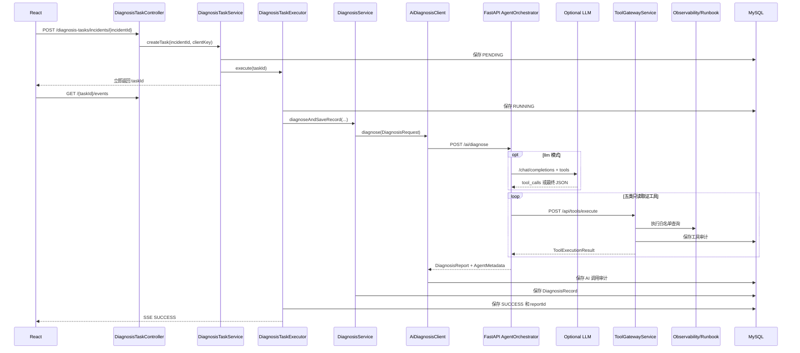

# 调用链与 API 说明

更新时间：2026-08-02。

这份文档解释 OpsMind AI 的真实调用顺序、模块职责、跨语言合同和常用 API。
LLM/RAG 内部策略与评测细节见
[LLM Agent、RAG 与评测](07-llm-agent-and-evaluation.md)。

## 一次完整诊断



可靠状态顺序：

```text
MySQL 状态先保存 -> Redis 快照更新 -> SSE 再推送
```

MySQL 是事实来源，Redis 是加速层，SSE 是实时通知。浏览器断线或 Redis 不可用时，
页面仍能从数据库恢复最近任务、报告和审计。

当前执行器是单实例进程内 `@Async`。服务启动时，`DiagnosisTaskRecoveryService` 会把
上次进程遗留的 `PENDING/RUNNING` 任务标记为 `FAILED`，刷新缓存并清理复用状态。
它不会自动重放旧任务，避免重复生成报告和工具审计；需要续跑和多实例接管时应升级为
带消费确认和幂等键的持久化消息队列。

## 模块职责

### `DiagnosisTaskService`

- 校验 Incident。
- 执行客户端限流和同 Incident 分布式去重。
- 查询 10 分钟内可复用的成功任务。
- 创建 `PENDING` 任务并立即返回。
- 查询任务或建立 SSE 订阅。

它不执行 AI，也不持有长时间 HTTP 请求。

### `DiagnosisTaskExecutor`

- 在 `@Async` 线程中执行诊断。
- 推进 `RUNNING / SUCCESS / FAILED`。
- 调用 `DiagnosisService`。
- 先保存数据库与缓存，再推送 SSE。
- 成功保存报告 id，失败保存面向用户的原因。

### `DiagnosisTaskRecoveryService`

- 在单实例应用启动后查询遗留的 `PENDING/RUNNING` 任务。
- 将无法续跑的旧任务持久化为 `FAILED`。
- 更新 Redis 快照并移除故障复用索引和锁。
- 不承担任务重放或多实例协调。

### `DiagnosisService`

- 查询 Incident 和初始观测上下文。
- 组装 Java/Python 之间的 `DiagnosisRequest`。
- 调用 `AiDiagnosisClient`。
- 保存结构化 `DiagnosisRecord`。
- 基于已保存报告生成事故复盘。

它不管理线程、SSE 或模型供应商配置。

### `AiDiagnosisClient`

- 使用 `RestClient` 调用 FastAPI `/ai/diagnose`。
- 应用连接与读取超时。
- 由 Resilience4j 提供重试、熔断和 Bulkhead。
- 保存成功或失败的 AI 调用审计。
- 记录执行模式、Token 和模型工具调用指标。
- 最终失败转换为稳定业务错误，不泄露内部响应。

### Python `AgentOrchestrator`

- 读取 `OPSMIND_DIAGNOSIS_MODE`。
- `deterministic` 调用本地稳定诊断器。
- `llm` 调用受控模型工具循环。
- 只捕获模型运行时和模型客户端错误进行显式 fallback。
- fallback 报告标记为 `LLM_FALLBACK`，不伪装成 LLM 成功。

### Python `LlmAgentRuntime`

- 调用 OpenAI-compatible `/chat/completions`。
- 维护 assistant/tool 消息循环和累计 usage。
- 收敛模型工具参数到当前 Incident。
- 要求五类工具均成功取证，失败调用需要重试且不计入覆盖，限制步数、工具数和结果长度。
- 校验最终 JSON 并写入可信 id 与 Agent 元数据。

### Python `ToolGatewayClient`

- 发送 `taskId`、`incidentId`、平台 `traceId`、工具名和参数。
- 调用 Spring `POST /api/tools/execute`。
- 从统一 `Result` 中提取内部工具结果。
- 将超时、连接失败、非 2xx 和合同错误转换为结构化 `FAILED`。
- 内部服务调用设置 `trust_env=False`，避免本机代理接管 Docker 服务名。

### `ToolGatewayService`

- 校验任务、Incident、工具名和参数。
- 确认任务与 Incident 归属一致。
- 校验服务名与 Incident 服务一致。
- Trace 必须来自当前 Incident 服务的日志证据。
- 只执行精确白名单。
- 保存审计、记录指标并推送 SSE 工具阶段。
- 将普通工具错误转换为结构化失败。

### RAG 模块

- `ChromaRunbookStore`：向量、文档和元数据读写。
- `BM25Index`：中英文稀疏评分。
- `HybridRunbookSearcher`：Dense 候选、BM25 排名和 RRF 融合。
- `search_runbooks`：HTTP 与诊断流程共用的兼容入口。

## 跨语言合同

### `DiagnosisRequest`

Spring 发送的关键字段：

```json
{
  "taskId": "task-uuid",
  "traceId": "platform-trace-id",
  "incident": {
    "id": "incident-uuid",
    "title": "支付服务超时导致订单结算失败",
    "serviceName": "payment-service",
    "severity": "HIGH",
    "status": "OPEN",
    "symptom": "支付接口响应超过 3 秒",
    "createdAt": "2026-08-02T08:00:00Z",
    "updatedAt": "2026-08-02T08:00:00Z"
  },
  "logs": [],
  "metrics": [],
  "traces": []
}
```

`taskId` 对旧同步合同保持可空，但 LLM Tool Calling 必须有异步任务 id。

### `DiagnosisReport`

```json
{
  "incidentId": "incident-uuid",
  "traceId": "platform-trace-id",
  "summary": "检测到支付下游调用持续超时。",
  "rootCause": "支付通道响应超时。",
  "evidence": ["日志出现 ReadTimeout", "Runbook: payment-timeout.md"],
  "recommendation": "检查下游健康并启用有边界的熔断降级。",
  "confidence": 0.86,
  "agentMetadata": {
    "executionMode": "DETERMINISTIC",
    "provider": "opsmind",
    "modelName": "deterministic-rag-agent",
    "promptVersion": "deterministic-v1",
    "inputTokens": 0,
    "outputTokens": 0,
    "toolCallCount": 0
  }
}
```

`incidentId` 和平台 `traceId` 在 LLM 模式下由运行时覆盖模型内容。历史数据库记录的
新元数据列允许为空，响应映射会提供确定性默认值，避免已有 Volume 启动失败。

### `ToolExecutionResult`

```json
{
  "toolName": "queryLogs",
  "status": "SUCCESS",
  "data": [],
  "errorMessage": null,
  "latencyMs": 2
}
```

工具级 `FAILED` 可以出现在 HTTP 200 的统一业务响应中，调用方必须检查
`data.status`，不能只看 HTTP 状态。

## 工具目录

| 工具 | 模型可调用 | 关键参数边界 | 作用 |
| --- | --- | --- | --- |
| `queryLogs` | 是 | 服务名强制绑定 Incident | 查询结构化日志 |
| `queryMetrics` | 是 | 服务名强制绑定 Incident | 查询指标 |
| `queryTrace` | 是 | Trace 必须来自当前证据 | 查询链路 Span |
| `searchRunbook` | 是 | query <= 500，nResults 1..5 | 混合检索 Runbook |
| `getRecentDeployments` | 是 | 服务名强制绑定 Incident | 查询最近发布 |
| `generateIncidentReport` | 否 | 用户在诊断后显式触发 | 生成事故复盘 |

## 核心 API

### 1. 注入故障

```bash
curl -X POST \
  http://127.0.0.1:8080/api/fault-scenarios/redis-connection-failure/inject
```

返回中的 `data.incident.id` 是后续 `incidentId`。

### 2. 创建异步任务

```bash
curl -X POST \
  http://127.0.0.1:8080/api/diagnosis-tasks/incidents/{incidentId}
```

接口立即返回 `data.id`，不会等待模型或向量检索。

### 3. 查询与恢复任务

```bash
curl http://127.0.0.1:8080/api/diagnosis-tasks/{taskId}

curl \
  "http://127.0.0.1:8080/api/diagnosis-tasks?incidentId={incidentId}"
```

### 4. 订阅 SSE

```bash
curl -N \
  -H "Accept: text/event-stream" \
  http://127.0.0.1:8080/api/diagnosis-tasks/{taskId}/events
```

阶段事件：

```text
PENDING
RUNNING
CALL_AI
TOOL_CALL
TOOL_SUCCESS
TOOL_FAILED
SUCCESS
FAILED
```

订阅建立时先发送当前快照。`SUCCESS` 携带 `diagnosisRecordId`，`FAILED` 携带
`failureReason`，终态发送后关闭连接。

### 5. 调用 Tool Gateway

```bash
curl -X POST \
  -H "Content-Type: application/json" \
  -d '{
    "taskId": "{taskId}",
    "incidentId": "{incidentId}",
    "toolName": "queryLogs",
    "arguments": {"serviceName": "cache-service"}
  }' \
  http://127.0.0.1:8080/api/tools/execute
```

未知或越权工具返回结构化失败，并留下审计：

```json
{
  "toolName": "unknownTool",
  "status": "FAILED",
  "data": null,
  "errorMessage": "不支持的工具: unknownTool",
  "latencyMs": 1
}
```

### 6. 查询审计与报告

```bash
curl "http://127.0.0.1:8080/api/tool-call-audits?taskId={taskId}"
curl "http://127.0.0.1:8080/api/ai-call-audits?taskId={taskId}"
curl "http://127.0.0.1:8080/api/diagnoses/incidents/{incidentId}/records"
```

AI 审计中的 `agentToolCallCount` 只统计模型循环，详细工具调用以第一条接口为准。

### 7. 生成事故复盘

```bash
curl -X POST \
  -H "Content-Type: application/json" \
  -d '{
    "taskId": "{taskId}",
    "incidentId": "{incidentId}",
    "toolName": "generateIncidentReport",
    "arguments": {"incidentId": "{incidentId}"}
  }' \
  http://127.0.0.1:8080/api/tools/execute
```

### 8. FastAPI 健康与 RAG

```bash
curl http://127.0.0.1:8000/ai/health

curl --get \
  --data-urlencode "query=OOMKilled 后内存基线持续上涨" \
  --data "n_results=3" \
  http://127.0.0.1:8000/ai/runbooks/search
```

健康响应包括 `diagnosisMode`、`llmConfigured` 和当前模型名，但不会触发 embedding
模型加载。

## Redis 键

```text
opsmind:diagnosis:task:{taskId}
opsmind:diagnosis:reuse:{incidentId}
opsmind:diagnosis:lock:{incidentId}
opsmind:diagnosis:rate:{clientKey}
```

| 键 | 作用 |
| --- | --- |
| `task` | 任务状态快照 |
| `reuse` | 短期成功任务复用 |
| `lock` | 封住并发创建窗口 |
| `rate` | 固定窗口客户端计数 |

Redis 异常时任务查询回源 MySQL；限流和锁 fail-open，避免缓存成为主业务单点。

## 失败与降级语义

| 失败位置 | 行为 |
| --- | --- |
| 单个确定性工具失败 | 使用已有请求上下文或空结果继续，审计为 FAILED |
| LLM 未知工具/越权/非法 JSON | 抛出 AgentRuntimeError |
| LLM 网络、HTTP 或响应合同错误 | 抛出 LlmClientError |
| LLM 错误且 fallback 开启 | 返回 `LLM_FALLBACK` 报告 |
| LLM 错误且 fallback 关闭 | Python 请求失败，由 Spring 稳定性边界处理 |
| Redis 缓存失败 | 回源或 fail-open，并记录警告 |
| AI 服务最终不可用 | 任务进入 FAILED，保存友好 failureReason |

只有预期的模型运行时/客户端错误触发 LLM fallback；未预期编程异常不会被宽泛捕获并
静默伪装成成功。

## HTTP 状态

| HTTP 状态 | 场景 |
| --- | --- |
| 200 | 请求成功；工具内部结果仍需检查 `data.status` |
| 400 | 参数错误、资源不存在、任务归属或工具范围不一致 |
| 409 | 同 Incident 任务处于极短并发创建窗口 |
| 429 | 客户端超过每分钟诊断创建上限 |
| 500 | 未预期系统异常；内部细节不暴露给前端 |

完整 Spring Schema：`http://127.0.0.1:8080/swagger-ui/index.html`。

完整 Python Schema：`http://127.0.0.1:8000/docs`。
